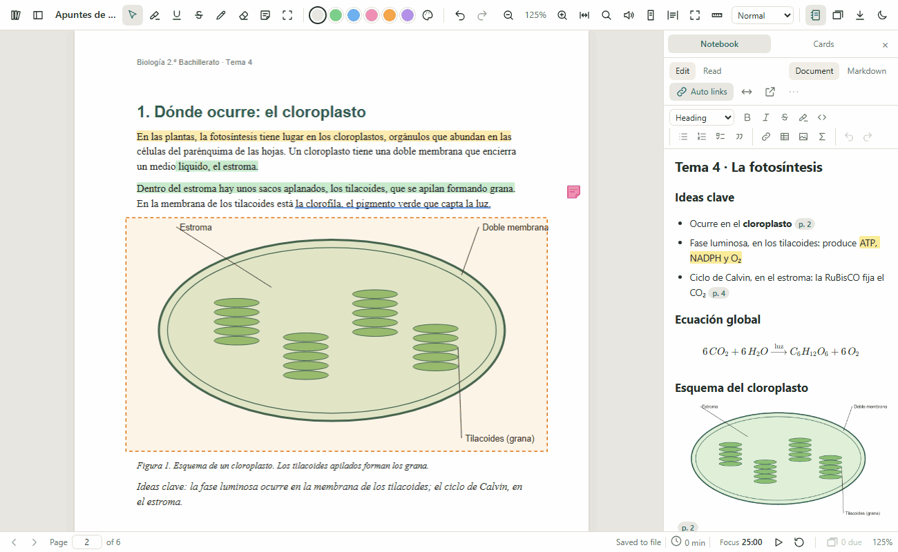
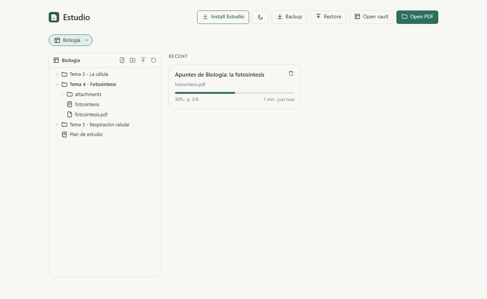
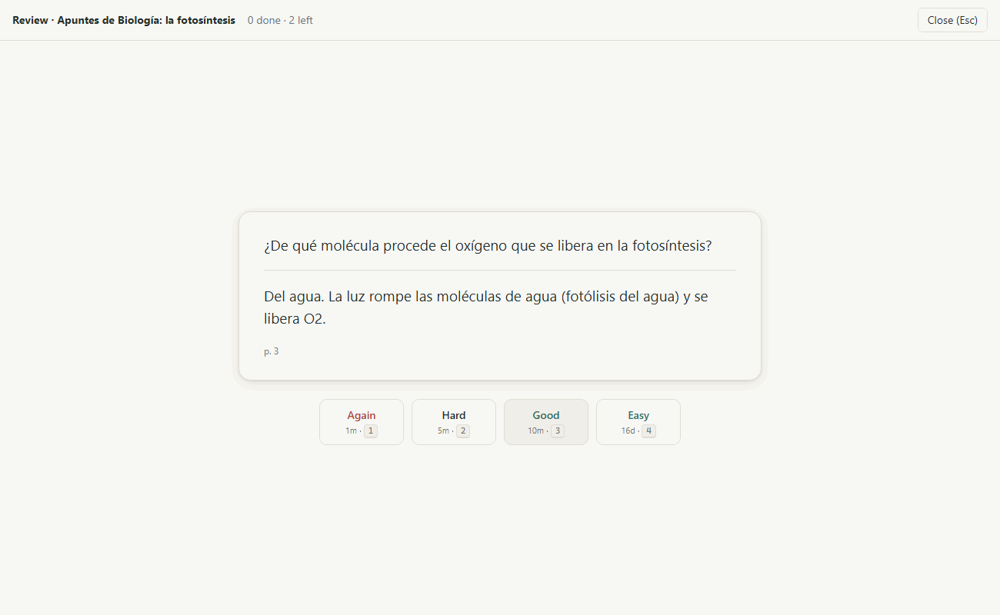

# Guía de uso de Estudio

Esta guía explica cómo usar Estudio paso a paso, sin dar nada por sabido. No hace falta leerla entera: busca en el índice lo que quieras hacer y ve directamente a ese apartado.

Un aviso antes de empezar: los botones y menús de Estudio están en inglés. En esta guía verás siempre el nombre del botón tal como aparece en pantalla, en **negrita**, y a su lado lo que significa.

## Índice

1. [Qué es Estudio](#qué-es-estudio)
2. [Instalarlo](#instalarlo)
3. [Abrir un PDF](#abrir-un-pdf)
4. [Leer](#leer)
5. [Subrayar y anotar](#subrayar-y-anotar)
6. [El cuaderno de notas](#el-cuaderno-de-notas)
7. [Dónde se guardan las cosas](#dónde-se-guardan-las-cosas)
8. [Carpetas tipo Obsidian (vaults)](#carpetas-tipo-obsidian-vaults)
9. [Tarjetas de estudio y repaso](#tarjetas-de-estudio-y-repaso)
10. [Exportar y copias de seguridad](#exportar-y-copias-de-seguridad)
11. [Atajos de teclado](#atajos-de-teclado)
12. [Actualizar Estudio](#actualizar-estudio)
13. [Problemas frecuentes](#problemas-frecuentes)
14. [Glosario](#glosario)

## Qué es Estudio

Estudio es un lector de PDF pensado para estudiar. Un PDF es el tipo de archivo en el que suelen venir los apuntes, los libros escaneados y los artículos: un documento que se ve igual en cualquier ordenador.

Con Estudio puedes:

- leer el PDF cómodamente, con índice, buscador y modo oscuro;
- subrayar en colores que significan algo (amarillo para lo importante, verde para las definiciones, y así con los demás);
- escribir tus apuntes en un cuaderno al lado del PDF, con enlaces que te llevan a la página de la que hablan;
- hacer tarjetas de preguntas y respuestas y repasarlas justo cuando estás a punto de olvidarlas.

Todo se queda en tu ordenador. Estudio no pide cuenta ni contraseña, no envía tus apuntes a ningún sitio y funciona sin internet una vez instalado.



## Instalarlo

Estudio se abre en el navegador (Edge o Chrome) y se instala como una aplicación más. Una vez instalado, tiene su propio icono en el menú Inicio y su propia ventana.

### Desde la dirección web (la forma normal)

Sirve para cualquier ordenador, tablet o móvil. La dirección web de Estudio es:

**<https://mikel-gonzalezt.github.io/estudio/>**

1. Abre esa dirección en Edge o en Chrome. **En un PC con Windows, usa Edge**: si haces de Estudio tu lector de PDF predeterminado, con Edge los archivos PDF muestran el icono de Estudio; con Chrome aparecen en blanco.
2. Pulsa **Install Estudio**, arriba en la pantalla de inicio.
3. Si no ves ese botón, abre el menú del navegador (los tres puntos de arriba a la derecha) y busca **Aplicaciones › Instalar este sitio como una aplicación** en Edge, o **Instalar Estudio** en Chrome.

En un iPad, Safari no muestra ese botón. Pulsa el botón de compartir (el cuadrado con una flecha hacia arriba) y elige **Añadir a pantalla de inicio**.

### Desde el código (solo para usuarios avanzados)

Si prefieres que la aplicación se sirva desde tu propio ordenador con Windows, necesitas tener instalado Node.js, un programa que prepara la aplicación.

1. Descarga la carpeta del proyecto.
2. Abre PowerShell dentro de esa carpeta. PowerShell es la ventana azul o negra de Windows donde se escriben órdenes.
3. Escribe esto y pulsa Intro:

   ```powershell
   powershell -ExecutionPolicy Bypass -File scripts\install.ps1
   ```

4. Espera a que termine. Se abrirá Edge con Estudio.
5. Pulsa el botón **Install Estudio** (instalar Estudio), arriba en la pantalla de inicio.

A partir de ahí abre Estudio desde el menú Inicio. No hace falta volver a hacer nada de esto, salvo para actualizarlo.

Aunque la abras desde una dirección de internet, los PDF y los apuntes no se suben a ningún sitio: se quedan en tu dispositivo, dentro del navegador. Cada persona y cada dispositivo tiene los suyos, y nadie más puede verlos.

Lo que guardes en la versión web no aparece en la que instalaste con el script, ni al revés. El navegador guarda por separado los datos de cada dirección.

### Qué funciona en el móvil y en la tableta

En un móvil Android o en un iPad puedes leer, subrayar, escribir en el cuaderno y repasar tarjetas. Hay dos cosas que no funcionan, porque esos navegadores no dejan que una página web escriba en tus carpetas:

- **Las carpetas de apuntes (vaults).** No puedes abrir una carpeta entera en Estudio.
- **Guardar dentro del PDF.** Tus subrayados se quedan dentro de Estudio, no dentro del archivo. Si quieres un PDF con los subrayados, usa **Annotated PDF** en el menú de descarga (mira [Exportar y copias de seguridad](#exportar-y-copias-de-seguridad)).

Estudio está pensado sobre todo para el ordenador. En el móvil funciona, pero no lo hemos probado a fondo.

## Abrir un PDF

Hay cuatro formas de abrir un PDF:

- Pulsa **Open PDF** (abrir PDF) en la pantalla de inicio y elige el archivo.
- Arrastra el archivo desde una carpeta hasta la ventana de Estudio.
- En el Explorador de archivos, pulsa con el botón derecho sobre el PDF y elige **Abrir con › Estudio**.
- Pulsa un documento de la lista **Recent** (recientes). Estudio recuerda en qué página te quedaste.



### Varios PDF a la vez

Cada PDF se abre en su propia ventana de Estudio. Así puedes tener dos documentos uno al lado del otro, por ejemplo un artículo y tus apuntes de clase.

- **Desde la lista Recent o desde el árbol de una carpeta de apuntes.** Pulsa el documento con `Ctrl` + clic, o con la rueda del ratón (clic central). Se abre en una ventana nueva y la que tienes delante no cambia. En la lista **Recent**, el botón con una flecha que aparece al pasar el ratón por encima hace lo mismo. En el árbol, el menú **⋯** tiene **Open in new window** (abrir en una ventana nueva).
- **Desde el panel Files del lector.** Un clic normal cambia el documento de esa ventana por el que pulsas, como siempre. Con `Ctrl` + clic se abre en otra ventana.
- **Desde el Explorador de archivos.** Si Estudio muestra la pantalla de inicio, el PDF se abre en esa ventana. Si ya estás leyendo otro, el nuevo va a una ventana aparte y el que lees no se cierra. Si abres varios PDF a la vez, cada uno tiene su ventana.
- **Una ventana vacía.** `Ctrl+N` abre otra ventana de Estudio con la pantalla de inicio.

Windows a veces no deja que Estudio abra una ventana por su cuenta. Entonces aparece abajo el aviso **Open archivo.pdf in a new window?** (¿abrir archivo.pdf en una ventana nueva?). Pulsa **Open** y se abre.

Para poner dos ventanas una al lado de la otra, pulsa en una de ellas `Windows` + flecha izquierda. Windows la pega a la mitad izquierda de la pantalla y te enseña las demás ventanas para que elijas cuál va a la derecha.

Un mismo PDF solo puede estar abierto en una ventana. Si intentas abrirlo otra vez, Estudio intenta traer al frente la ventana que ya lo tiene y te avisa con **Already open in another window** (ya está abierto en otra ventana). Si esa ventana no aparece delante, búscala en la barra de tareas.

Las ventanas se entienden entre ellas. Si cambias el tema, el modo de página o cualquier otro ajuste en una, las demás lo adoptan. Una carpeta de apuntes que añades en una ventana aparece en las demás. Y si empiezas a leer en voz alta en una ventana, la que estaba leyendo se calla.

### Hacer que los PDF se abran siempre con Estudio

Si quieres que un doble clic en cualquier PDF lo abra en Estudio:

1. Abre **Configuración** de Windows (la rueda dentada del menú Inicio).
2. Ve a **Aplicaciones › Aplicaciones predeterminadas**.
3. En el buscador de arriba escribe `.pdf`.
4. Pulsa la aplicación que aparece al lado y elige **Estudio**.

### La carpeta Descargas, el Escritorio y Documentos

Edge nunca deja que una página web tenga permiso sobre las carpetas **Descargas**, **Escritorio** o **Documentos** enteras. Dice que contienen archivos del sistema. Sí deja usar cualquier carpeta que esté dentro de ellas.

Por eso, si Estudio te pide elegir una carpeta, no elijas Descargas. Crea una subcarpeta, por ejemplo `Descargas\Estudio` o `Documentos\Apuntes`, mueve ahí tus PDF y elige esa.

## Leer

La barra de arriba tiene casi todo lo que necesitas para leer. Si pasas el ratón por encima de un botón, aparece su nombre y su tecla.

- **Moverte.** Usa la rueda del ratón, o las teclas `j` y `k`. Para saltar de página en página, `Av Pág` y `Re Pág`. Abajo a la izquierda puedes escribir un número de página para ir directamente.
- **Volver atrás.** Si has saltado a otra página (desde el índice o un enlace), `Alt` + flecha izquierda te devuelve a donde estabas.
- **Zoom.** Los botones de lupa, o `Ctrl` + rueda del ratón. `Ctrl+0` ajusta el ancho de la página a la ventana.
- **Ajustar al texto.** La tecla `w` (o su botón en la barra) amplía la página hasta que el texto ocupa todo el ancho y deja los márgenes blancos fuera de la vista. Vuelve a pulsar `w` para deshacerlo.
- **Índice.** El botón de la barra lateral (o la tecla `b`) abre un panel a la izquierda con el índice del documento, las miniaturas de las páginas y la lista de tus subrayados.
- **Buscar.** Pulsa `Ctrl+F` o `/`, escribe una palabra y pulsa Intro. `F3` va al siguiente resultado.
- **Modo oscuro y sepia.** El desplegable **Normal** de la barra cambia el color de las páginas: **Dark pages** (páginas oscuras) o **Sepia** (color papel antiguo, más suave para la vista). El botón de la luna cambia el resto de la aplicación a oscuro.
- **Modo concentración.** La tecla `f` esconde todas las barras y deja solo el documento. Vuelve a pulsar `f` para recuperarlas.
- **Regla de lectura.** La tecla `r` oscurece todo menos una franja que sigue al ratón. Ayuda a no perder la línea.
- **Citas.** En los artículos cuyas referencias son enlaces, si pasas el ratón por encima de una como [12], Estudio te enseña a qué artículo se refiere. El botón **Open paper** abre el artículo en internet, y **Search Scholar** lo busca en Google Académico.

### Leer en voz alta

Estudio puede leerte el documento en voz alta.

- Pulsa el botón del altavoz en la barra, o la tecla `l`. Empieza a leer desde el principio de la página que tienes en pantalla.
- Si seleccionas un trozo de texto, el menú que aparece tiene un altavoz: **Read aloud from here** (leer desde aquí).
- La frase que se está leyendo se marca en la página, y la página avanza sola.
- La barra de abajo sirve para pausar, ir a la frase anterior o siguiente, parar, cambiar la velocidad y elegir la voz.

Estudio solo usa las voces instaladas en Windows. Así funciona sin internet y tu texto no sale del ordenador. Elige sola una voz del idioma del documento (español o inglés).

Si un documento en inglés se lee con acento español, o aparece el aviso **No offline English voice installed** (no hay voz en inglés instalada), añade una voz:

1. Abre **Configuración** de Windows.
2. Ve a **Hora e idioma › Voz**.
3. Pulsa **Agregar voces**, elige por ejemplo **English (United States)** y espera a que se descargue.
4. Cierra Estudio y vuelve a abrirlo.

## Subrayar y anotar

### Las herramientas

Las herramientas están a la izquierda de la barra. Cada una tiene una tecla:

| Herramienta | Tecla | Para qué sirve |
| --- | --- | --- |
| Seleccionar | `v` o `Esc` | Seleccionar texto y pulsar tus anotaciones |
| Subrayar (resaltar) | `h` | Pasar el rotulador por encima del texto |
| Subrayado con línea | `u` | Una línea debajo del texto |
| Tachar | `x` | Una línea que tacha el texto |
| Lápiz | `p` | Dibujar a mano alzada, por ejemplo una flecha o un círculo |
| Goma | `e` | Borrar anotaciones pasando por encima |
| Nota | `n` | Pegar una nota adhesiva en cualquier punto de la página |
| Recorte de zona | `a` | Marcar un rectángulo, por ejemplo alrededor de una figura |

Para subrayar, elige la herramienta y arrastra el ratón sobre el texto. También puedes seleccionar el texto con la herramienta normal y elegir el tipo de subrayado en el menú que aparece.

Para poner una nota, pulsa `n`, haz clic donde quieras la nota, escribe y pulsa **Add note** (añadir nota) o `Ctrl+Intro`.

### Colores con significado

Hay seis colores, y cada uno significa algo. Los eliges con los círculos de la barra o con las teclas `1` a `6`:

| Tecla | Color | Significado |
| --- | --- | --- |
| `1` | Amarillo | Important (importante) |
| `2` | Verde | Definition (definición) |
| `3` | Azul | Example (ejemplo) |
| `4` | Rosa | Doubt / review (duda o repasar) |
| `5` | Naranja | Formula (fórmula) |
| `6` | Morado | Personal idea (idea propia) |

Puedes cambiar los significados: pulsa el botón de la paleta de pintor, al lado de los colores (**Edit colour meanings**), y escribe los tuyos.

### Recortes de zona y figuras fijadas

Un recorte de zona es un rectángulo que dibujas alrededor de algo, normalmente una figura o una fórmula. Al terminarlo aparece un pequeño menú con dos opciones útiles:

- **Send to notes** (enviar a las notas) copia esa zona como imagen en tu cuaderno, con un enlace a su página.
- **Pin** (fijar) deja la figura en un panel pequeño abajo a la derecha, que sigue a la vista mientras lees. Cuando el libro dice "ver figura 3" diez páginas después, la tienes delante sin volver atrás. La tecla `P` (mayúscula) esconde y muestra ese panel.

### Deshacer

`Ctrl+Z` deshace el último cambio y `Ctrl+Y` lo rehace. Funciona con todo: subrayados, notas, dibujos y borrados. Para borrar una anotación concreta, haz clic en ella y pulsa `Supr`.

## El cuaderno de notas

Cada PDF tiene su propio cuaderno, un documento en blanco al lado del PDF donde escribes tus apuntes. Ábrelo con el botón del cuaderno, arriba a la derecha, o con `N` (mayúscula).

### Modo Documento y modo Markdown

El cuaderno tiene dos formas de escribir, que se eligen arriba a la derecha:

- **Document** (documento) funciona como Word o Google Docs: escribes y usas la barra de botones para poner negrita, títulos o listas. Es el modo que viene puesto y el que te recomendamos.
- **Markdown** muestra el texto con unos símbolos sencillos, por ejemplo `**negrita**` o `# Título`. Markdown es una forma de escribir texto con formato usando solo el teclado. Es el formato en que Estudio guarda tus notas, y lo usan otros programas de apuntes como Obsidian.

Puedes cambiar de modo cuando quieras. Cambiar de modo no cambia nada de lo que has escrito.

En el modo Documento hay dos pestañas: **Edit** (editar) para escribir y **Read** (leer) para ver el resultado limpio, sin la barra de botones.

### La barra de formato

En el modo Documento, la barra de botones del cuaderno sirve para:

- elegir el tipo de texto en el desplegable: **Normal text** (texto normal), **Title** (título), **Heading** (encabezado) o **Subheading** (subencabezado);
- poner **negrita** (`Ctrl+B`), *cursiva* (`Ctrl+I`), tachado o resaltado en amarillo;
- hacer listas con viñetas, listas numeradas, listas de tareas con casillas y citas;
- insertar un enlace a la página, una tabla, una imagen o una fórmula.

Si prefieres el teclado, al principio de una línea `# ` crea un título, `- ` una lista y `1. ` una lista numerada.

### Enlaces a páginas

Lo más útil del cuaderno son los enlaces a páginas. Son unas etiquetas pequeñas, como **p. 12**, que al pulsarlas llevan el PDF a esa página.

- **`Ctrl+L`** pone un enlace a la página que tienes en pantalla.
- **`[[`** (dos corchetes seguidos) abre una lista: la página actual, los apartados del índice y tus subrayados. Elige uno con las flechas y pulsa Intro.
- **Enlaces automáticos.** Con el botón **Auto links** activado, cada párrafo nuevo empieza solo con un enlace a la página que estás leyendo, si has cambiado de página desde el último enlace.
- **Citar.** Selecciona un trozo del PDF y pulsa **Quote** (citar) en el menú. El texto se copia al cuaderno como cita, con su enlace a la página.

### Imágenes

- **Pegar.** Haz una captura de pantalla (`Windows + Mayús + S`) y pégala en el cuaderno con `Ctrl+V`.
- **Arrastrar.** Arrastra una imagen desde una carpeta hasta el cuaderno.
- **Desde el PDF.** Haz un recorte de zona (`a`) alrededor de una figura y pulsa **Send to notes**. La figura se copia con buena calidad y con su enlace a la página.

### Tablas

Pulsa el botón de tabla para crear una. Dentro de la tabla, `Tab` pasa a la celda siguiente y `Mayús+Tab` a la anterior. `Intro` en la última fila añade otra fila. Cuando el cursor está en una tabla, aparecen botones para añadir o borrar filas y columnas.

### Fórmulas

Pulsa el botón **Σ** o `Ctrl+M` para abrir el editor de fórmulas. Tiene un teclado matemático en pantalla con fracciones, raíces, potencias y letras griegas, así que no necesitas saber cómo se escriben las fórmulas a mano. Pulsa **Done** (hecho) para insertarla. Para cambiar una fórmula, haz clic en ella.

Si sabes LaTeX (el lenguaje con el que se escriben fórmulas en ciencias), también puedes escribirla directamente entre signos de dólar: `$E=mc^2$`.

### Ventana aparte y ancho

- **Más ancho.** El botón de las dos flechas (o `W` mayúscula) ensancha el cuaderno. Vuelve a pulsarlo para devolverlo a su tamaño.
- **Ajustar a mano.** Arrastra el borde entre el PDF y el cuaderno. Un doble clic en ese borde lo devuelve a su sitio.
- **Ventana aparte.** El botón de la flecha que sale de un cuadrado (**Open in its own window**) abre el cuaderno en su propia ventana. Es cómodo si tienes dos pantallas. Los enlaces a páginas siguen funcionando desde ahí.

## Dónde se guardan las cosas

Estudio guarda solo, sin que pulses nada. Conviene saber dónde queda cada cosa.

**Los subrayados, notas y dibujos se guardan dentro del propio PDF.** Así, si abres ese PDF con otro programa (Adobe Acrobat, el visor de Edge), verás tus subrayados. Abajo a la derecha, la barra de estado te dice cómo va:

- **Saved to file**: guardado en el archivo.
- **Saving…**: guardando.
- **Unsaved (click to allow)**: sin guardar; haz clic para dar permiso. Pasa la primera vez que Estudio escribe en un archivo, porque el navegador pide permiso. No se pierde nada mientras tanto.

**El cuaderno se guarda como un archivo `.md`** (un archivo de texto en formato Markdown) de una de estas maneras:

- **Junto al PDF.** Si el PDF está en una carpeta de apuntes (vault), el cuaderno se guarda al lado con el mismo nombre: `tema4.pdf` tiene su `tema4.md`.
- **Dentro de Estudio.** Si abriste el PDF desde cualquier otra carpeta, el cuaderno se queda guardado dentro de Estudio, y arriba del cuaderno verás **Saved inside Estudio · Save as file** (guardado dentro de Estudio, guardar como archivo).

Para pasar un cuaderno de dentro de Estudio a un archivo, pulsa **Save as file** y elige:

- **Next to the PDF** (junto al PDF). Estudio te pide permiso una vez sobre la carpeta del PDF y guarda el cuaderno ahí, con el mismo nombre. Los demás PDF de esa carpeta ya guardarán su cuaderno al lado sin preguntar. Recuerda que no puede ser la carpeta Descargas entera (mira [la carpeta Descargas](#la-carpeta-descargas-el-escritorio-y-documentos)).
- **In a vault folder…** (en una carpeta de apuntes). Guarda el cuaderno en la carpeta de apuntes que elijas.

**Las tarjetas, tu progreso de lectura y tus ajustes se guardan dentro de Estudio**, en la memoria del navegador. No están en ningún archivo tuyo. Por eso es buena idea hacer de vez en cuando una copia completa (mira [Exportar y copias de seguridad](#exportar-y-copias-de-seguridad)).

## Carpetas tipo Obsidian (vaults)

Un vault (en inglés, "caja fuerte") es simplemente una carpeta normal de tu ordenador donde guardas los PDF y los apuntes de una asignatura. Obsidian es un programa de notas muy conocido que usa esta misma idea, y Estudio es compatible con él.

Para abrir una carpeta como vault:

1. En la pantalla de inicio, pulsa **Open vault** (abrir vault).
2. Elige la carpeta. Recuerda que no puede ser Descargas, Escritorio ni Documentos enteras: usa una carpeta dentro de ellas.
3. Acepta el permiso que pide el navegador.

A la izquierda aparece el árbol de la carpeta, con sus subcarpetas, sus PDF y sus notas. Pulsa un PDF para abrirlo. Desde el árbol puedes:

- crear notas y carpetas nuevas con los botones de arriba del árbol;
- importar PDF con el botón de la flecha hacia arriba, o arrastrándolos encima de una carpeta;
- cambiar el nombre (botón derecho, o `F2`), mover (arrastrando) y borrar (botón derecho, o `Supr`).

Cuando cierres y abras Estudio otro día, puede que la carpeta muestre **Allow access** (permitir acceso). Pulsa una vez y vuelve a funcionar. Es el navegador pidiendo permiso de nuevo.

Si usas Obsidian, puedes abrir la misma carpeta en los dos programas. Obsidian entiende los enlaces a páginas de Estudio. Un aviso: no edites la misma nota en Obsidian y en Estudio a la vez, porque Estudio sobrescribe lo que cambies en Obsidian mientras esa nota está abierta en Estudio.

## Tarjetas de estudio y repaso

Una tarjeta es una pregunta con su respuesta, como las fichas de papel de toda la vida. Estudio usa la repetición espaciada: te enseña cada tarjeta justo antes de que la olvides, y cada vez espera más tiempo antes de volver a enseñártela.

### Hacer una tarjeta

1. Selecciona en el PDF el texto que quieres recordar.
2. En el menú que aparece, pulsa **Card** (tarjeta).
3. Elige el tipo:
   - **Basic** (básica): escribe la pregunta en **Front** (anverso). El texto que seleccionaste ya está en **Back** (reverso) como respuesta; cámbialo si quieres.
   - **Cloze** (huecos): selecciona las palabras que quieres ocultar y pulsa **Make gap** (hacer hueco). Al repasar, esas palabras aparecen tapadas.
4. Pulsa **Add card** (añadir tarjeta) o `Ctrl+Intro`.

Puedes ver todas las tarjetas del documento en la pestaña **Cards**, junto al cuaderno (o con `C` mayúscula).

### Repasar

Abajo a la derecha, la barra de estado muestra cuántas tarjetas tienes pendientes (**due**). Para repasarlas, pulsa ese botón o `R` (mayúscula).



1. Lee la pregunta e intenta responder de memoria.
2. Pulsa la barra espaciadora para ver la respuesta.
3. Di con sinceridad lo bien que la sabías, con un botón o con las teclas `1` a `4`:
   - **Again** (otra vez): no la sabías. Vuelve dentro de un minuto.
   - **Hard** (difícil): la sabías, pero te costó.
   - **Good** (bien): la sabías.
   - **Easy** (fácil): la sabías sin pensar. Tardará mucho en volver.

Debajo de cada botón ves cuándo volverá la tarjeta si lo pulsas, por ejemplo **10m** (10 minutos) o **16d** (16 días). Con `Esc` sales del repaso.

## Exportar y copias de seguridad

Exportar es sacar una copia de tu trabajo en otro formato. El botón de descarga de la barra de arriba (la flecha hacia abajo, **Export**) ofrece:

| Opción | Qué obtienes |
| --- | --- |
| **Markdown (highlights, notes, notebook)** | Un archivo `.md` con tus subrayados, tus notas y el cuaderno |
| **Notes only (.md)** | Solo el texto del cuaderno, sin nada más |
| **Notes as Word (.docx)** | El cuaderno como documento de Word, con títulos, tablas, imágenes y fórmulas que Word puede editar |
| **Notes as PDF** | El cuaderno listo para imprimir. En la ventana de impresión, elige **Guardar como PDF** |
| **Annotated PDF** | Una copia del PDF con todos tus subrayados y notas |
| **Full backup (JSON)** | Una copia completa de todo lo que guarda Estudio |

### La copia completa

La copia completa guarda lo que está dentro de Estudio: la lista de documentos recientes, los subrayados, los cuadernos guardados dentro de Estudio, las tarjetas con su calendario de repaso y los ajustes. Las imágenes pegadas en esos cuadernos no entran en la copia. Hazla de vez en cuando, sobre todo antes de cambiar de ordenador.

- **Hacer la copia.** En la pantalla de inicio, pulsa **Backup**. Se descarga un archivo.
- **Recuperarla.** En la pantalla de inicio, pulsa **Restore** (restaurar) y elige ese archivo.

Los PDF y los cuadernos que ya están en tus carpetas no van en la copia, porque ya son archivos tuyos. Cópialos como cualquier otra carpeta, por ejemplo a un disco externo.

## Atajos de teclado

No hace falta aprenderse ninguno. `Ctrl+K` abre un buscador con todas las acciones de Estudio y su tecla: escribe lo que quieres hacer (en inglés, por ejemplo "notebook") y pulsa Intro.

Las letras en mayúscula (`N`, `W`, `R`…) se escriben con `Mayús`.

**Leer y moverse**

| Tecla | Qué hace |
| --- | --- |
| `j` / `k` | Bajar / subir |
| `J` / `K`, `Av Pág` / `Re Pág` | Página siguiente / anterior |
| `Inicio` / `Fin` | Primera / última página |
| `g` | Ir a una página |
| `Alt` + flecha izquierda / derecha | Volver / avanzar después de un salto |
| `Ctrl` `+` / `Ctrl` `-` | Acercar / alejar |
| `Ctrl+0` / `Ctrl+9` | Ajustar al ancho / ajustar la página entera |
| `w` | Ajustar al texto (quitar márgenes) |
| `Ctrl+F` o `/` | Buscar |
| `F3` / `Mayús+F3` | Resultado siguiente / anterior |
| `b` | Mostrar u ocultar el panel izquierdo |
| `f` | Modo concentración |
| `r` | Regla de lectura |
| `l` | Leer en voz alta / pausar |
| `Ctrl` + clic, clic central | Abrir un documento en una ventana nueva |
| `Ctrl+N` | Abrir otra ventana de Estudio |
| `Ctrl+K` | Buscador de acciones |

**Anotar**

| Tecla | Qué hace |
| --- | --- |
| `v` o `Esc` | Seleccionar |
| `h`, `u`, `x` | Subrayar, subrayar con línea, tachar |
| `p`, `e` | Lápiz, goma |
| `n` | Nota adhesiva |
| `a` | Recorte de zona |
| `1` a `6` | Color |
| `Ctrl+Z` / `Ctrl+Y` | Deshacer / rehacer |
| `Supr` | Borrar la anotación seleccionada |
| `Alt+P` | Fijar o soltar el recorte seleccionado |
| `P` | Mostrar u ocultar las figuras fijadas |

**Cuaderno y tarjetas**

| Tecla | Qué hace |
| --- | --- |
| `N` | Abrir el cuaderno |
| `C` | Abrir las tarjetas |
| `B` | Mostrar u ocultar el panel derecho |
| `W` | Ensanchar el cuaderno / devolverlo a su ancho |
| `R` | Repasar las tarjetas pendientes |
| `Ctrl+L` (en el cuaderno) | Enlace a la página que tienes en pantalla |
| `[[` (en el cuaderno) | Elegir una página, un apartado o un subrayado para enlazarlo |
| `Ctrl+B`, `Ctrl+I` (en el cuaderno) | Negrita, cursiva |
| `Ctrl+Mayús+X`, `Ctrl+Mayús+H` (en el cuaderno) | Tachado, resaltado |
| `Ctrl+E` (en el cuaderno) | Código (letra de máquina de escribir) |
| `Ctrl+Intro` (en el cuaderno) | Marcar o desmarcar una casilla de tarea |
| `Ctrl+M` (en el cuaderno) | Insertar o cambiar una fórmula |
| `Tab` / `Mayús+Tab` (en el cuaderno) | Meter o sacar un nivel en una lista; pasar de celda en una tabla |
| Barra espaciadora, luego `1` a `4` (repaso) | Ver la respuesta, luego Again, Hard, Good o Easy |

## Actualizar Estudio

**Si lo instalaste desde la dirección web**, se actualiza solo. Cuando hay una versión nueva, Estudio la descarga y la aplica cuando ninguna ventana tiene un documento abierto, es decir, cuando la última vuelve a la pantalla de inicio. Nunca se actualiza con un documento abierto, así que no pierdes nada.

**Si lo instalaste desde el código en Windows**, vuelve a ejecutar la orden de instalación:

```powershell
powershell -ExecutionPolicy Bypass -File scripts\install.ps1
```

Después abre Estudio como siempre. La próxima vez que muestre la pantalla de inicio, cambiará a la versión nueva.

## Problemas frecuentes

**No veo el botón "Install Estudio".**
El botón solo aparece mientras el navegador permite instalar. Si Estudio ya está instalado, no aparece: búscalo en el menú Inicio. Si no está instalado, recarga la página con `Ctrl+Mayús+R`, o usa el menú de Edge: **Aplicaciones › Instalar este sitio como una aplicación**.

**Los archivos PDF aparecen sin icono.**
Pasa si instalaste Estudio con Chrome y lo pusiste como lector predeterminado: Chrome no les da icono a los PDF. Haz una copia de seguridad (**Backup**), instala Estudio desde Edge, restaura la copia (**Restore**), vuelve a elegirlo como lector predeterminado y desinstala la copia de Chrome.

**Me pide permiso para guardar ("Unsaved (click to allow)").**
Es normal. El navegador pide permiso la primera vez que Estudio escribe en un archivo, y otra vez después de reiniciar. Haz clic en el aviso y acepta. Tus cambios no se pierden mientras tanto, porque Estudio guarda su propia copia.

**Me dice "No offline English voice installed".**
No tienes ninguna voz en inglés instalada en Windows. Añade una en **Configuración › Hora e idioma › Voz › Agregar voces** (mira [Leer en voz alta](#leer-en-voz-alta)).

**Una fórmula sale subrayada en rojo.**
La fórmula tiene un error y Estudio no sabe dibujarla. Pasa el ratón por encima y verás qué falla, por ejemplo `Formula error: Undefined control sequence` (hay una orden que no existe). Haz clic en ella para corregirla con el editor de fórmulas.

**No encuentro el archivo `.md` de mis notas.**
Mira encima del cuaderno. Si pone **Saved inside Estudio · Save as file**, el cuaderno todavía no es un archivo: está dentro de Estudio. Pulsa **Save as file** y elige **Next to the PDF** (mira [Dónde se guardan las cosas](#dónde-se-guardan-las-cosas)). Si el PDF está en una carpeta de apuntes, el `.md` está a su lado con el mismo nombre.

**No puedo elegir la carpeta Descargas.**
Edge no lo permite con Descargas, Escritorio ni Documentos. Crea una carpeta dentro, por ejemplo `Descargas\Estudio`, mueve ahí el PDF y elige esa carpeta.

**Tengo dos copias del mismo PDF y comparten las notas.**
Estudio reconoce un PDF por su contenido, no por su nombre. Dos copias idénticas son para Estudio el mismo documento, así que comparten subrayados, cuaderno y tarjetas. Además, al abrir la segunda copia, Estudio escribe en ella los subrayados de la primera. Si quieres apuntes distintos, usa un solo archivo por documento.

**Un PDF no guarda los subrayados en el archivo.**
Si el PDF está protegido con contraseña, Estudio no puede escribir en él, y la barra de estado lo dice. Tus subrayados siguen guardados dentro de Estudio. Para tener un PDF con ellos, usa **Annotated PDF** en el menú de descarga.

**Me dice "Already open in another window".**
Ese PDF ya está abierto en otra ventana de Estudio, y un documento solo puede estar abierto en una. Busca esa ventana en la barra de tareas. Si quieres abrirlo aquí, ciérralo antes en la otra ventana (botón **Library**) y vuelve a intentarlo.

**Aparece "Open archivo.pdf in a new window?".**
Windows no dejó que Estudio abriera la ventana por su cuenta. Pulsa **Open** para abrirla, o **Dismiss** (descartar) si no la quieres.

**El botón de abrir en una ventana nueva está gris.**
Ese documento se abrió sin acceso a su archivo (por ejemplo, arrastrado desde algunos programas), así que solo puede abrirse en la ventana actual. Ábrelo una vez con **Open PDF** y a partir de entonces podrá ir a otra ventana.

**Se abrió una ventana y la cerré sin querer.**
Si era el cuaderno en ventana aparte, vuelve a abrirlo con el botón **Open in its own window**, o pulsa **Bring back** (traer de vuelta) en el panel del cuaderno.

## Glosario

- **PDF.** Un tipo de archivo para documentos que se ven igual en cualquier ordenador. Los apuntes, libros y artículos suelen venir en PDF.
- **Markdown.** Una forma de escribir texto con formato usando solo el teclado, por ejemplo `**negrita**`. Tus cuadernos se guardan así, en archivos que terminan en `.md`.
- **Vault.** Una carpeta normal donde guardas los PDF y los apuntes de una asignatura. La palabra viene de Obsidian.
- **Obsidian.** Un programa de notas muy usado que trabaja con carpetas de archivos Markdown. Estudio puede compartir carpeta con él.
- **Anotación.** Cualquier marca que haces en el PDF: un subrayado, una nota, un dibujo o un recorte.
- **Recorte de zona.** Un rectángulo que marcas en la página, normalmente alrededor de una figura.
- **Enlace a página.** Una etiqueta como **p. 12** en el cuaderno que lleva el PDF a esa página.
- **Repetición espaciada.** Un método para memorizar: repasas cada cosa justo antes de olvidarla, cada vez más espaciado.
- **Tarjeta de huecos (cloze).** Una tarjeta con palabras tapadas que tienes que recordar.
- **Exportar.** Sacar una copia de tu trabajo en otro formato, como Word o PDF.
- **Copia de seguridad.** Un archivo con todo lo que guarda Estudio, para recuperarlo si cambias de ordenador o algo falla.
